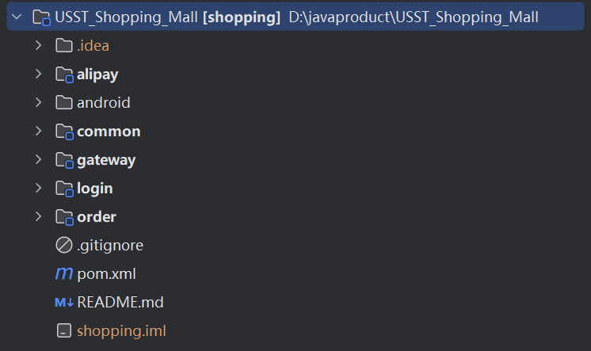

# 说明

这是上海理工大学移动应用开发第五次实验课的小作业，要求实现一个购物车的功能。

## 运行环境

用的不是最新的mysql8.0.35，而是mysql8.0.11，所以要注意查看有没有下载对应的mysql版本的驱动包。

用的注册中心是consul，需要下载对应运行程序，确保在8500端口上启动好服务注册中心。

## 效果

后端采用Spring Cloud框架，采用微服务架构。将服务拆分成登录模块，支付模块，商品模块三大模块。数据库使用Mysql。

项目结构如下：

​                               

其中，alipay继承了支付宝的支付模块，android是安卓端的代码，common用来存放公共VO，DTO，POJO类，gateway是微服务网关，login是登录模块，order是商品订单模块。sql的生成文件放在了common文件夹下方，有个.db结尾的文件，就是它了。

数据库主要是四张表：

 

ER图结构如下：

 

分别用来存放商品信息，订单详细信息，订单信息和用户信息。

系统的主页面：

 

点击支付跳转到支付页面：

 

扫描进行支付：

 

点击主菜单可以进入页面选择：

 

点击历史订单可以看到历史下单情况：

 

当然，看消息的前提是要登录之后才可以查看，所以需要先进入登录界面：

 

点击注册可以进入用户注册：

